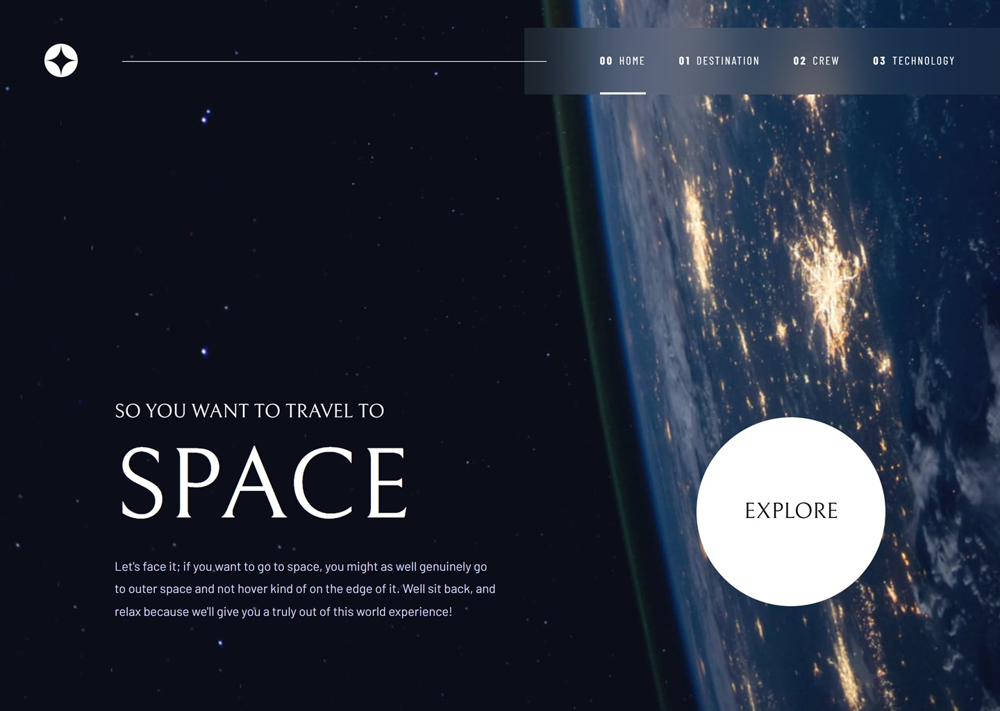

# Frontend Mentor - Space tourism website solution

This is a solution to the Space tourism website challenge on Frontend Mentor. The project recreates a multi-page space tourism experience based on the provided Figma design, with responsive layouts for desktop, tablet, and mobile devices.

The application is built with React and Vite, with reusable components, data-driven page states, responsive styling, client-side routing, and Motion-based transitions.

## Table of contents

- [Overview](#overview)
  - [The challenge](#the-challenge)
  - [Screenshot](#screenshot)
  - [Links](#links)
  - [Pages](#pages)
- [My process](#my-process)
  - [Built with](#built-with)
  - [What I learned](#what-i-learned)
- [Author](#author)

## Overview

### The challenge

Users should be able to:

- View the optimal layout for each page depending on their device's screen size
- Navigate between the Home, Destination, Crew, and Technology pages
- View different destination, crew, and technology states
- Toggle between destination tabs
- Navigate between crew members
- Navigate between technology states
- See hover states for interactive elements
- Use the responsive mobile navigation menu
- Experience animated transitions between page states
- Navigate the interface using accessible interactive controls

### Screenshot



### Links

- **Live Site URL:** https://space-tourism-omega-two.vercel.app/
- **Frontend Mentor Challenge:** https://www.frontendmentor.io/challenges/space-tourism-multipage-website-gRWj1URZ3

### Pages

The application contains four primary routes:

| Route | Page | States |
| --- | --- | ---: |
| `/` | Home | 1 |
| `/destination` | Destination | 4 |
| `/crew` | Crew | 4 |
| `/technology` | Technology | 3 |

#### Home

The landing page introduces the space tourism experience and provides the primary `EXPLORE` call-to-action.

#### Destination

The Destination page allows users to explore:

- Moon
- Mars
- Europa
- Titan

Each destination has its own image, description, average distance, and estimated travel time.

#### Crew

The Crew page presents four crew members:

- Douglas Hurley — Commander
- Mark Shuttleworth — Mission Specialist
- Victor Glover — Pilot
- Anousheh Ansari — Flight Engineer

#### Technology

The Technology page presents three technologies:

- Launch Vehicle
- Spaceport
- Space Capsule

The page content and imagery are driven from a shared data source rather than separate page implementations.

## My process

### Built with

- Semantic HTML5 markup
- CSS custom properties
- Responsive CSS
- Flexbox
- CSS Grid
- Mobile-first workflow
- JavaScript ES6+
- [React](https://react.dev/) — UI library
- [Vite](https://vite.dev/) — Build tool and development server
- [React Router](https://reactrouter.com/) — Client-side routing
- [Motion](https://motion.dev/) — Animation and transitions
- [Sass](https://sass-lang.com/) — CSS preprocessor
- ESLint — Code quality and linting
- Responsive image assets using PNG, WebP, and page-specific background images

### Design system

The implementation follows the provided Space Tourism design system.

#### Colors

| Token | Value | Usage |
| --- | --- | --- |
| `blue-900` | `#0B0D17` | Main background |
| `blue-300` | `#D0D6F9` | Secondary text, accents, borders |
| `white` | `#FFFFFF` | Primary text and light surfaces |

#### Typography

| Font | Usage |
| --- | --- |
| `Bellefair` | Display headings and large values |
| `Barlow Condensed` | Navigation, labels, metadata, section headings |
| `Barlow` | Body copy |

The typography hierarchy uses large Bellefair display headings combined with Barlow Condensed navigation and Barlow body copy to reproduce the visual language of the original design.

#### Responsive layouts

The design references three primary viewport classes:

| Device | Reference |
| --- | --- |
| Mobile | `375px` |
| Tablet | `768px` |
| Desktop | `1440px` |

The implementation uses responsive layouts rather than treating these dimensions as fixed canvases.

### What I learned

#### Building reusable data-driven pages

One of the main architectural decisions was separating page content from presentation.

Destination, crew, and technology information is stored in a shared data source, allowing the same page components to render different states.

For example:

```js
const destinations = [
  {
    name: 'Moon',
    description: '...',
    distance: '384,400 km',
    travel: '3 days',
  },
];
```

This approach avoids creating separate components for every destination or crew member and makes the interface easier to maintain.

#### Managing navigation and page state

The project uses React Router to handle the application's primary routes while local state is used where appropriate for content-state navigation.

This creates a distinction between:

- Page-level navigation
- Content-state navigation
- Mobile navigation state

#### Implementing responsive component variants

The Figma design provides substantially different compositions for desktop, tablet, and mobile.

Instead of simply scaling the desktop layout down, the implementation adapts component structure and positioning for smaller viewports.

Examples include:

- Desktop navigation becoming a mobile menu
- Destination content changing from a two-column layout to a vertical layout
- Crew imagery moving above the textual content on mobile
- Technology pagination changing from vertical to horizontal
- The `EXPLORE` button scaling from the desktop presentation to the mobile presentation

#### Adding motion between content states

The project uses Motion to provide transitions between changing page content.

Direction-aware transitions allow content to enter and leave according to the user's navigation direction, creating a more natural slide-based interaction between states.

## Author

- GitHub - [@shrigel](https://github.com/shrigel)
- Frontend Mentor - [@shrigel](https://www.frontendmentor.io/profile/shrigel)